# HanYu Tong — 汉语通

> 面向外国人的中文学习 App，支持 5 种母语界面，覆盖词汇、成语、谚语、诗词、语法、文化六大学习模块，接入 AI 语音识别与智能评分，帮助学习者从零基础到高阶全面提升中文水平。

---

## 目录

- [项目简介](#项目简介)
- [界面展示](#界面展示)
- [核心功能](#核心功能)
- [技术架构](#技术架构)
- [多语言支持](#多语言支持)
- [项目结构](#项目结构)
- [数据资产](#数据资产)
- [快速开始](#快速开始)
- [页面说明](#页面说明)
- [开发进度](#开发进度)
- [仓库信息](#仓库信息)

---

## 项目简介

**HanYu Tong（汉语通）** 是一款专为外国人设计的中文学习 App。用户可以：

1. **听 → 解释**：听中文词汇/成语/谚语，用母语语音解释含义，AI 进行智能评分
2. **读 → 评测**：朗读中文，AI 评测发音与声调准确度

分级体系覆盖从零基础到高阶：

| 级别 | 对应等级 | 词汇来源 |
|------|----------|----------|
| 入门 | HSK 1–2 级 | hsk1_2.json |
| 初级 | HSK 3–4 级 | hsk3_4.json |
| 中级 | HSK 5–6 级 | hsk5_6.json |
| 高级 | HSK 7–9 级 | hsk7_9.json |

---

## 界面展示

### LTR 语言界面（Windows 桌面）

| |                     | |
|---|---------------------|---|
| 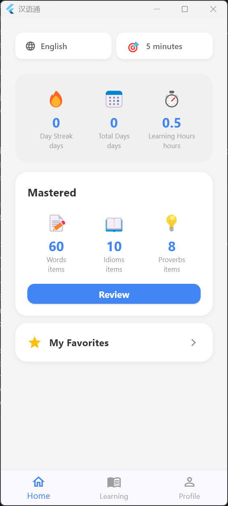 | 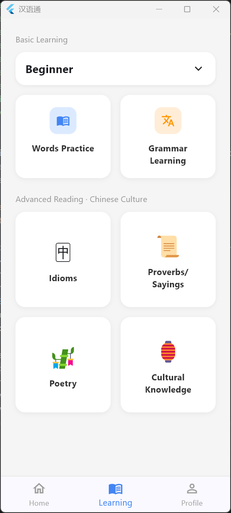  | 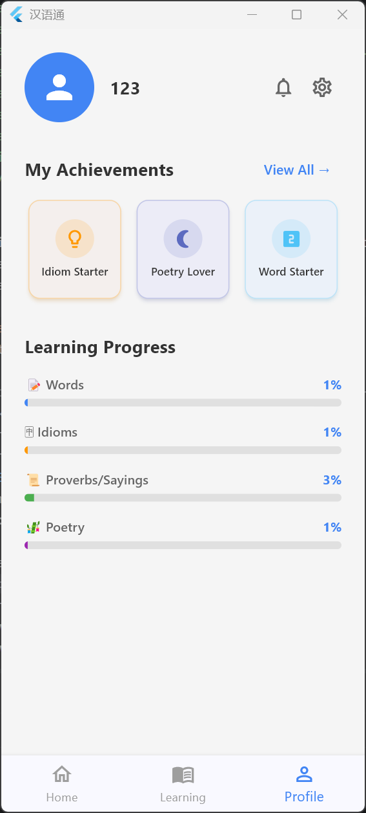 |
|  |   |  |
|  | 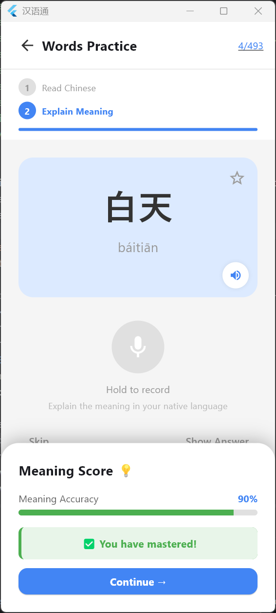  | 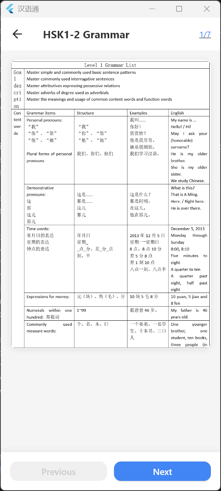 |
|  |  |  |
| 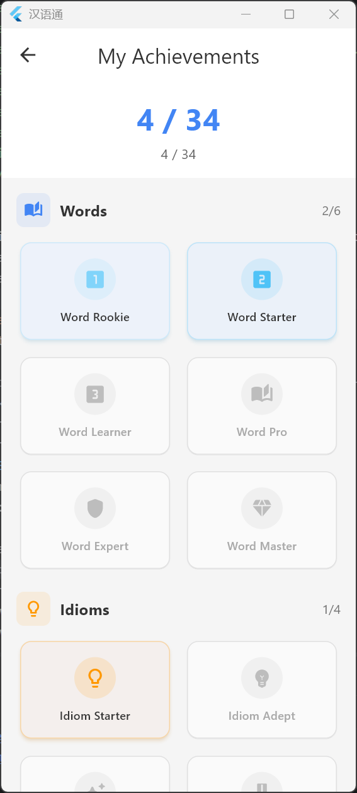 | 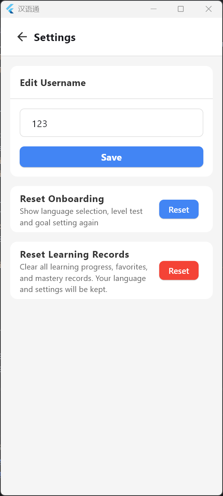 | | |

### RTL 语言界面（Windows 桌面）

|                     |                     |                     |
|---------------------|---------------------|---------------------|
| 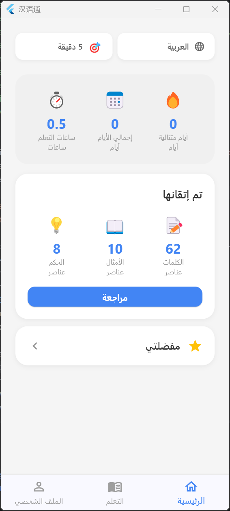 | 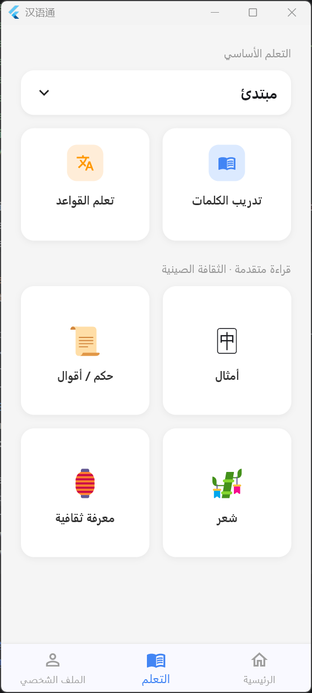 | 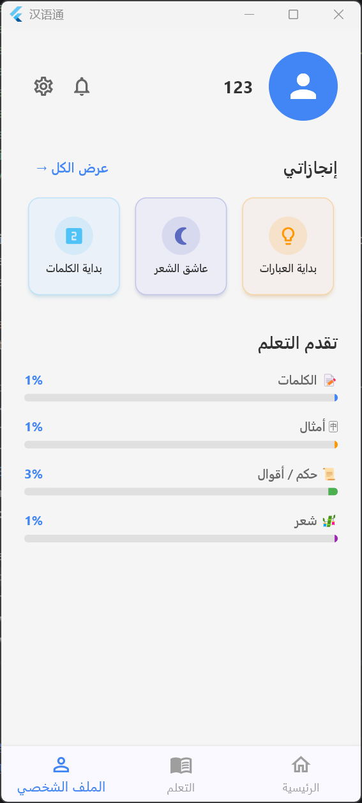 |

### Android 真机界面

|                     |                     |                     |
|---------------------|---------------------|---------------------|
| 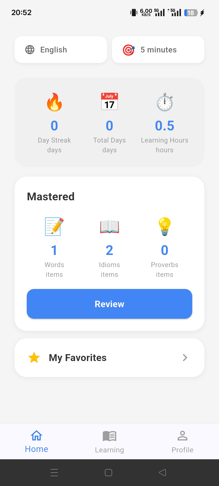 | 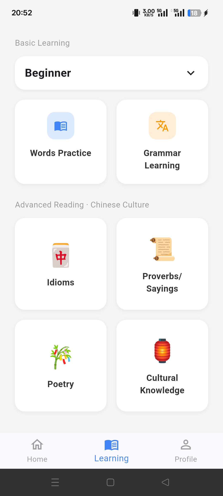 | 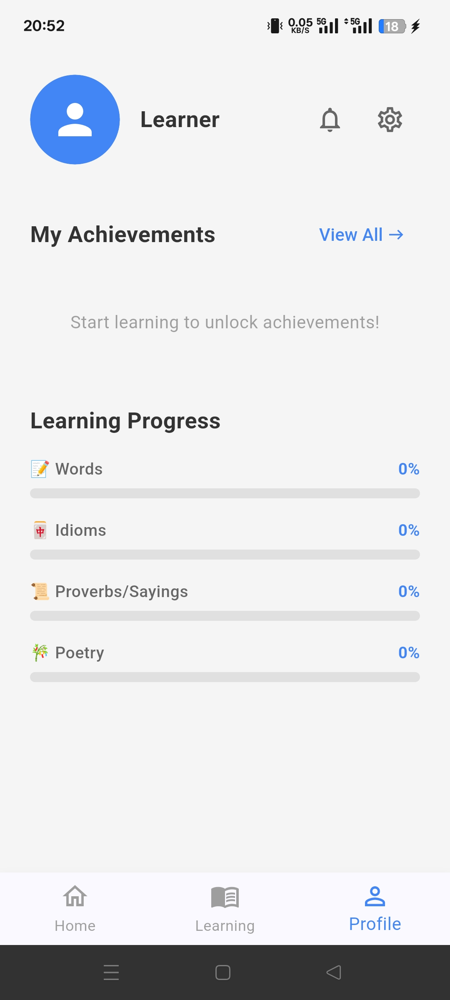 |

---

## 核心功能

### 📖 六大学习模块

| 模块 | 说明 | 评测 |
|------|------|------|
| **词汇学习** | 按难度分级的中文词汇，支持母语翻译、拼音、掌握追踪 | ✅ 两步 AI 评分 |
| **成语学习** | 常用成语及其母语释义，支持跳转、翻页 | ✅ 两步 AI 评分 |
| **谚语学习** | 中文谚语俗语及母语翻译，支持跳转、翻页 | ✅ 两步 AI 评分 |
| **诗词学习** | 古诗词原文+中文释义+母语释义，支持收藏、详情页 | 纯浏览 |
| **语法学习** | 5 种语言的语法知识 PNG 图片，按难度分 4 级 | 纯浏览 |
| **文化知识** | 24 节气 + 13 节日，纯文本展示，支持序号跳转、翻页 | 纯浏览 |

### 🎯 掌握追踪与复习
- 词汇/成语/谚语支持"掌握"标记（学习中可标记，复习页按难度筛选复习）
- 首页显示 4 条学习进度条（词语/成语/谚语/诗词），实时反映掌握进度
- 收藏页 4 个选项卡：词语、成语、谚语、诗词

### 🤖 AI 评分系统（已接入）
两步评分流程，基于阿里云百炼（DashScope）API：

**Step 1（朗读评测）**：
- 用户朗读中文词卡，按住麦克风录音
- 语音识别：Qwen-ASR-Flash 将录音转为文字
- **空音频防护**：录音文件 < 5KB 或 API 返回"音频为空"时直接返回 0 分
- 发音评分：通义千问（qwen-turbo）对比用户朗读与正确答案，给出 0-100 分
- 支持重试：可反复录音练习，满意后再进入下一步

**Step 2（语义评测）**：
- 用户用母语语音解释含义
- 语音识别：Qwen-ASR-Flash 将母语音频转为文字
- **空音频防护**：未发声时直接返回 0 分
- **安全加固**：检测到中文字符时直接返回 0-10 分，防止读中文原文得高分
- 语义评分：通义千问对比用户解释与标准翻译，给出 0-100 分
- 评分门槛：≥ 70 分标记为"已掌握"，< 70 分需重试

### 🔊 TTS 语音合成
- 接入 Edge TTS（微软在线语音合成），中文发音质量高
- 学习页词卡的中文词语、成语、谚语均可点击播放标准发音
- 支持 Windows、Android、iOS 平台
- TTS 服务内置调试日志，方便排查问题

### 🏆 成就系统
7 大类别，共 34 个成就徽章，激励持续学习：

| 类别 | 成就等级 |
|------|----------|
| **词汇掌握** | 10 / 50 / 100 / 500 / 1000 / 3000 词 |
| **成语掌握** | 10 / 50 / 100 / 500 个 |
| **谚语掌握** | 10 / 30 / 50 / 100 个 |
| **诗词学习** | 5 / 10 / 50 / 100 首 |
| **收藏数量** | 10 / 50 / 100 / 500 / 1000 / 3000 个 |
| **连续学习** | 3 / 7 / 14 / 30 天 |
| **累计学习** | 3 / 7 / 15 / 30 / 100 / 365 天 |

- 个人页面展示最近 3 个解锁成就
- 全屏成就页面查看所有成就及解锁进度
- 支持查看每个成就的解锁时间

### 🔍 通用功能
- **序号跳转**：词汇/成语/谚语/诗词/语法/文化知识均支持序号输入跳转
- **翻页浏览**：上一项/下一项按钮，最后一项显示"关闭"
- **收藏功能**：词语、成语、谚语、诗词支持收藏，收藏页分类查看
- **通知中心**：通知页面（暂无通知时显示占位界面）

---

## 技术架构

### 前端（Flutter）
```
框架：Flutter（支持 Android、iOS、Windows Desktop）
状态管理：Provider + SharedPreferences
路由：go_router（自定义淡入淡出动画 200ms）
国际化：自定义 AppLocalizations（5 种语言，120+ 键值）
```

### AI 服务（阿里云百炼 DashScope）
```
语音识别：Qwen-ASR-Flash（录音转文字，支持中文 + 英/俄/土/波/阿 5 种母语）
发音评分：通义千问 qwen-turbo（对比朗读与正确答案）
语义评分：通义千问 qwen-turbo（对比用户解释与标准翻译）
语音合成：Edge TTS（微软在线中文语音）
```

### 主要依赖
```yaml
provider: ^6.1.2              # 状态管理
go_router: ^14.3.0            # 路由
shared_preferences: ^2.3.2    # 本地存储
window_manager: ^0.3.9        # Windows 窗口控制（手机比例 390×844）
flutter_localizations          # 国际化支持
intl: ^0.20.2                 # 国际化工具
record: ^5.2.1                # 录音（Android + Windows + iOS）
permission_handler: ^11.3.1   # 权限申请（麦克风等）
path_provider: ^2.1.4         # 获取临时目录（录音文件）
edge_tts: ^0.1.4              # Edge TTS 语音合成
audioplayers: ^6.1.0          # 音频播放
http: ^1.2.0                  # HTTP 客户端（调用 DashScope API）
```

---

## 多语言支持

App 支持 **5 种界面语言**，涵盖 LTR 和 RTL 两种布局方向：

| 语言 | 代码 | 布局方向 | 原生名称 |
|------|------|----------|----------|
| 英语 | `en` | LTR（从左到右） | English |
| 俄语 | `ru` | LTR | Русский |
| 土耳其语 | `tr` | LTR | Türkçe |
| 波斯语 | `fa` | **RTL**（从右到左） | فارسی |
| 阿拉伯语 | `ar` | **RTL**（从右到左） | العربية |

### 实现方式

- **本地化类**（`lib/l10n/app_localizations.dart`）：120+ 个本地化键值，覆盖所有界面文本
- **语言配置**（`lib/config/app_languages.dart`）：`AppLanguage` 数据类 + `supportedLanguages` 全局列表
- **RTL 布局支持**（`lib/utils/rtl_utils.dart` / `lib/utils/rtl_layout.dart`）：自动检测语言方向，提供 `RtlAwareWidget` 包装组件
- 支持在运行时动态切换语言，无需重启 App

### 本地化文本覆盖范围

所有页面均已完整本地化：语言选择、水平测试、目标设置、首页、学习页、个人页、词汇/成语/谚语/诗词/语法/文化知识学习页、收藏页、复习页、设置页等。

---

## 项目结构

```
lib/
├── main.dart                        # 应用入口，配置国际化框架
├── router.dart                      # go_router 路由配置（含淡入淡出动画）
├── app_state.dart                   # 全局状态管理（Provider）
│
├── config/
│   └── app_languages.dart           # 语言配置（AppLanguage 类，supportedLanguages 列表）
│
├── l10n/
│   └── app_localizations.dart       # 本地化类（5 种语言，120+ 键值）
│
├── models/
│   ├── word_model.dart              # 词汇数据模型
│   ├── word_repository.dart         # 词汇数据仓库
│   ├── idiom_model.dart             # 成语数据模型
│   ├── idiom_repository.dart        # 成语数据仓库
│   ├── proverb_model.dart           # 谚语数据模型
│   ├── proverb_repository.dart      # 谚语数据仓库
│   ├── poetry_model.dart            # 诗词数据模型
│   ├── poetry_repository.dart       # 诗词数据仓库
│   ├── culture_model.dart           # 文化知识数据模型
│   └── culture_repository.dart      # 文化知识数据仓库
│
├── screens/
│   ├── splash_screen.dart           # 启动页
│   ├── language_selection.dart      # 语言选择（首次启动）
│   ├── level_test.dart              # 水平测试
│   ├── goal_setting.dart            # 学习目标设置
│   ├── main_layout.dart             # 底部导航栏布局
│   ├── home_tab.dart                # 首页（学习进度、快速入口）
│   ├── learn_tab.dart               # 学习页（模块选择）
│   ├── profile_tab.dart             # 我的页面（展示最近3个成就）
│   ├── practice_page.dart           # 词汇学习（卡片式+AI评分+掌握标记+序号跳转）
│   ├── advanced_practice.dart       # 成语/谚语学习（卡片式+AI评分+掌握标记）
│   ├── idioms_review_page.dart      # 成语复习
│   ├── proverbs_review_page.dart    # 谚语复习
│   ├── words_review_page.dart       # 词汇复习
│   ├── review_page.dart             # 复习入口页
│   ├── grammar_practice_page.dart   # 语法学习（5 种语言 PNG 图片翻页）
│   ├── culture_practice_page.dart   # 文化知识学习（24 节气 + 13 节日）
│   ├── poetry_detail_page.dart      # 诗词详情页（原文+释义）
│   ├── favorites_page.dart          # 收藏页（4 个选项卡）
│   ├── achievements_page.dart       # 成就页面（全屏展示7类34个成就）
│   ├── notifications_page.dart      # 通知页面
│   ├── settings_page.dart           # 设置页
│   └── empty_page.dart              # 占位页面
│
├── services/
│   ├── ai_service.dart              # AI 评分服务（DashScope ASR + 通义千问评分）
│   └── tts_service.dart             # TTS 语音合成服务（Edge TTS）
│
├── utils/
│   ├── rtl_utils.dart               # RTL 语言检测工具
│   └── rtl_layout.dart              # RTL 布局包装组件
│
└── widgets/
    ├── sound_wave_button.dart       # 声波喇叭按钮组件（录音+TTS 播放）
    └── step_indicator.dart          # 步骤指示器组件
```

---

## 数据资产

```
assets/
├── icon/                            # App 图标
│   └── app_icon.png
│
├── words/                           # 词汇数据（4 个难度级别）
│   ├── hsk1_2.json                  # 入门（HSK 1-2）
│   ├── hsk3_4.json                  # 初级（HSK 3-4）
│   ├── hsk5_6.json                  # 中级（HSK 5-6）
│   └── hsk7_9.json                  # 高级（HSK 7-9）
│
├── idioms/
│   └── idioms.json                  # 成语数据
│
├── proverb_saying/
│   └── proverb_saying.json          # 谚语俗语数据
│
├── poetry/
│   └── poetry.json                  # 古诗词数据
│
├── culture/
│   └── culture.json                 # 文化知识（24 节气 + 13 节日）
│
└── grammar/                         # 语法知识图片（5 种语言 × 4 个难度）
    ├── en/                          # 英语版（24 张 PNG）
    │   ├── hsk1_2/                  # 入门（7 张）
    │   ├── hsk3/                    # 初级（5 张）
    │   ├── hsk4/                    # 中级（5 张）
    │   └── hsk5_6/                  # 高级（7 张）
    ├── ru/                          # 俄语版（27 张 PNG）
    ├── tr/                          # 土耳其语版（24 张 PNG）
    ├── ar/                          # 阿拉伯语版（20 张 PNG）
    └── fa/                          # 波斯语版（21 张 PNG）
```

### 词汇 JSON 字段顺序

```
word → pinyin → english → russian → turkish → arabic → persian
```

---

## 快速开始

### 环境要求

- Flutter SDK 3.x（推荐最新稳定版）
- Dart 3.x
- Android Studio 或 VS Code（安装 Flutter 插件）
- Windows 系统（当前主要在 Windows Desktop 模式开发/测试）

### 安装步骤

```bash
# 1. 克隆项目
git clone https://gitee.com/linlinsh/han-yu_-tong_-app_basic.git
cd han-yu_-tong_-app_basic

# 2. 安装依赖
flutter pub get

# 3. 生成 Windows 桌面支持（首次需要）
flutter create --platforms=windows .

# 4. 运行
flutter run -d windows
```

> **Windows 窗口说明**：App 在 Windows 上以手机比例运行（390×844），由 `window_manager` 控制窗口大小，模拟真实手机体验。

### Android 真机部署

```bash
flutter run -d <device-id>
```

### Android APK 打包

```bash
# 确保 android/key.properties 文件存在（含签名密钥密码）
# 打包 release 版本
flutter build apk --release
```

> **APK 输出路径**：`build/app/outputs/flutter-apk/app-release.apk`
> **APK 大小**：约 32.4MB（arm64 单架构）

### Android 权限说明

Android APK 需要以下权限（已配置在 AndroidManifest.xml）：
- `INTERNET`：访问网络（Edge TTS + DashScope API）
- `RECORD_AUDIO`：麦克风录音

### API 配置

AI 评分功能需要配置阿里云百炼 API Key：

在 `lib/services/ai_service.dart` 中修改 `_apiKey` 为你的 DashScope API Key（在[阿里云百炼控制台](https://bailian.console.aliyun.com/)获取）。

---

## 页面说明

### 首次启动流程
```
SplashScreen → 语言选择 → 水平测试 → 学习目标设置 → 主界面
```

### 主界面（底部导航栏）
| Tab | 功能 |
|-----|------|
| 首页 | 学习统计（连续天数、累计天数、学习时长）、已掌握统计（词语/成语/谚语）、复习入口、收藏入口 |
| 学习 | 按模块选择：词汇、语法、成语、谚语、诗词、文化知识 |
| 我的 | 个人信息、学习统计、**成就展示**（最近3个）、通知入口、设置（重置引导、重置学习记录） |

### 学习模块导航
```
学习页
├── 词汇学习 → 按难度选择 → 卡片式学习（AI 发音评分 + 语义评分 → 标记掌握）
├── 语法学习 → 按难度选择 → PNG 图片翻页（5 种语言）
├── 成语学习 → 卡片式学习（AI 评分 + 标记掌握 + 序号跳转）
├── 谚语学习 → 卡片式学习（AI 评分 + 标记掌握 + 序号跳转）
├── 诗词学习 → 翻页浏览（中文释义+母语释义，可收藏，纯浏览无评分）
├── 文化知识 → 24 节气 + 13 节日翻页浏览
```

### 复习系统
- **复习入口页**：4 个难度选项卡（入门/初级/中级/高级），每个选项卡显示对应难度的已掌握词汇列表
- **成语/谚语复习**：独立复习页面，筛选已掌握项
- **收藏页**：4 个选项卡（词语/成语/谚语/诗词），显示收藏列表

### AI 评分流程

**词汇/成语/谚语练习**（`practice_page.dart` / `advanced_practice.dart`）
- Step 1（朗读）：展示中文词卡（大字+拼音），点击喇叭播放 TTS 发音，按住麦克风录音朗读，松手提交发音评分
  - 评分弹窗显示分数（≥80 绿 / ≥60 橙 / <60 红）
  - **再试一次**：关闭弹窗，留在发音步骤，可重新录音
  - **下一步**：进入语义评测步骤
- Step 2（解释）：按住麦克风用母语解释含义，松手提交语义评分
  - 评分弹窗显示分数
  - ≥ 70 分：显示"掌握成功 ✅" + "继续"按钮
  - < 70 分：显示"再试一次"按钮，需重新录音
- 两步均通过自动标记为"已掌握"

**诗词学习**：纯翻页浏览模式，无评分；点击"中文释义"和"母语释义"两个按钮查看翻译，两个都点过后标记为"已学习"

---

## 开发进度

### 已完成 ✅
- [x] 完整 Flutter 项目骨架（20 个页面）
- [x] 所有页面 UI 实现
- [x] go_router 路由配置（含页面切换动画）
- [x] Provider 状态管理（AppState 掌握追踪、语言/难度切换）
- [x] Windows Desktop 运行支持
- [x] 5 种界面语言（英/俄/土/波斯/阿拉伯）
- [x] RTL 布局完整支持（波斯语/阿拉伯语）
- [x] 所有界面文本完整本地化（120+ 键值）
- [x] 真实词汇数据接入（4 个难度 JSON 文件）
- [x] 成语学习接入真实数据（idioms.json）
- [x] 谚语学习接入真实数据（proverb_saying.json）
- [x] 诗词学习接入真实数据（poetry.json）
- [x] 文化知识学习（24 节气 + 13 节日）
- [x] 语法学习支持 5 种语言（en/ru/tr/ar/fa），按难度分 4 级
- [x] 词汇/成语/谚语掌握追踪与复习功能
- [x] 收藏功能（词语/成语/谚语/诗词）
- [x] 首页 4 模块学习进度条
- [x] 序号跳转功能（词汇/成语/谚语/诗词/语法/文化知识）
- [x] 诗词详情页（原文 + 释义）
- [x] 项目重命名为 HanYu_Tong
- [x] Android 真机部署支持
- [x] iOS 代码准备（Info.plist 麦克风权限、Podfile）
- [x] flutter analyze 零错误零警告
- [x] Git 配置（.gitattributes，LF 行尾符）
- [x] 录音功能接入（record + permission_handler，支持 Windows + Android + iOS）
- [x] TTS 语音合成接入（Edge TTS + audioplayers，中文标准发音）
- [x] AI 语音识别接入（Qwen-ASR-Flash，DashScope API）
- [x] AI 发音评分接入（通义千问 qwen-turbo，对比朗读与正确答案）
- [x] AI 语义评分接入（通义千问 qwen-turbo，对比用户解释与标准翻译）
- [x] 发音评分支持重试（"再试一次"按钮）
- [x] 完整两步评分链路（录音 → ASR 转文字 → 大模型评分 → 掌握判定）
- [x] 语义评分安全加固（防止读中文原文得高分）
- [x] Android APK 网络权限修复（INTERNET 权限）
- [x] TTS 调试日志功能
- [x] Android release APK 打包（32.4MB，arm64 单架构）
- [x] AI 评分空音频修复（用户不说话时返回 0 分，而非随机高分）
- [x] **成就系统**（7 类 34 个徽章：词汇/成语/谚语/诗词/收藏/连续学习/累计天数）
- [x] 通知页面（暂无通知占位界面）

### 计划中 📋
- [ ] iOS 真机测试
- [ ] 用户账号系统
- [ ] 学习数据云同步
- [ ] 网页版（Web 平台）

---

## 仓库信息

- **Gitee**：https://gitee.com/linlinsh/han-yu_-tong_-app_basic
- **分支**：master
